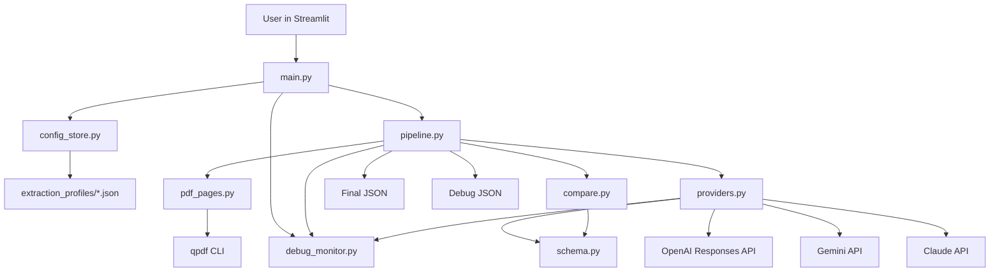

# Architecture

Generated from the current source tree on 2026-04-19.

## Purpose

The application extracts structured records from PDFs using configurable
profiles and multiple model providers. Its central design is not "one model
returns JSON"; it is "two baseline providers must agree after deterministic
normalization, otherwise an optional mediator or manual review is used."

## Component Diagram

## Layers

### UI Layer

`main.py` owns all Streamlit rendering and user interaction:

- sidebar model and environment status controls,
- profile editing and validation,
- PDF upload,
- extraction progress,
- live run debugging and timing reports,
- final JSON and debug JSON display,
- download buttons.

The UI constructs a `PipelineConfig` and calls `process_document`. It does not
directly call provider APIs.

### Pipeline Layer

`pipeline.py` coordinates the workflow:

- split the source PDF into one-page PDFs,
- build optional anchor/context extraction windows,
- initialize provider adapters,
- process each anchor page,
- build optional anchor key manifests,
- run OpenAI and Gemini baseline calls concurrently,
- compare baseline outputs,
- call mediation if needed and configured,
- merge records into final page results,
- build final document export and debug export,
- clean up temporary page PDFs.

### Provider Layer

`providers.py` contains thin adapters around provider SDK calls:

- `OpenAIExtractor` uploads a page or anchor/context PDF and requests strict
  JSON Schema output through the Responses API.
- `GeminiExtractor` uploads a page or anchor/context PDF and requests JSON
  output with a JSON schema.
- Both baseline adapters can run an anchor key-manifest pass on one page before
  full extraction when the selected profile enables page context.
- `ClaudeMediator` sends a base64 page or anchor/context PDF plus baseline
  outputs and the deterministic diff for dispute resolution.

Each adapter returns a `ProviderResult`, including parsed JSON, raw text, and an
error string if the call or parsing failed. When a debug monitor is attached,
the adapters also record elapsed time and provider usage metadata for the final
run report and debug export.

### Debug Monitor Layer

`debug_monitor.py` owns optional run reporting:

- per-call elapsed time,
- normalized token usage when provider SDK responses include it,
- provider-level timing and token totals,
- Streamlit rendering for the final run report.

The pipeline and provider modules only call narrow monitor hooks so reporting
can be removed without changing the extraction rules.

### Schema and Prompt Layer

`schema.py` turns extraction profiles into:

- app-level validation errors,
- provider JSON Schemas,
- preview JSON shapes,
- key-manifest prompts,
- extraction prompts,
- mediation prompts.

This module is the source of truth for supported field types and normalizer
names.

### Canonicalization and Comparison Layer

`compare.py` validates raw provider JSON against the generated schema, applies
profile-driven normalizers, indexes records by the configured key field, and
compares OpenAI and Gemini field-by-field.

This layer deliberately stays generic. It does not know about WT-500, alarm
codes, or any document-specific field.

### Profile Persistence Layer

`config_store.py` stores profile JSON files under `extraction_profiles/`.
Profiles are named by `profile.name`, converted into safe filenames with
`slugify`.

### PDF Preparation Layer

`pdf_pages.py` uses the `qpdf` command line tool to count PDF pages, create
temporary one-page PDFs, and create two-page anchor/context PDFs when the
selected profile opts into following-page context.

## Runtime Boundaries

- **Python process**: Streamlit app and all orchestration logic.
- **Local command dependency**: `qpdf` for deterministic page splitting.
- **Remote model APIs**: OpenAI, Gemini, and optionally Claude.
- **Local filesystem**: saved profiles and temporary PDFs.

## Important Architectural Choices

### Profile-Driven Output

The code avoids hard-coded output fields. Profiles define the record shape,
normalizers, and optional next-page context. The same profile drives validation,
prompts, provider schemas, canonicalization, and UI previews.

### Baseline Agreement Before Mediation

OpenAI and Gemini are treated as independent baseline extractors. Agreement is
checked after schema validation and normalization. Claude is only used when
there is a baseline disagreement and an Anthropic API key is configured.

### Anchor-Page Processing

The default system still sends one page at a time. Profiles can opt into one
following context page for records that continue across a page boundary. In that
mode, the anchor page first gets a model-derived key manifest, then full
extraction receives the anchor page plus the next page and is constrained to the
manifest keys.

### Debuggability

The pipeline returns both final JSON and debug JSON. Debug output includes raw
provider results, canonicalized records, diffs, model names, and page statuses.
For context-enabled profiles, debug output also includes context page numbers
and key-manifest details.

## Current Limitations

- There is no dependency manifest such as `requirements.txt` or `pyproject.toml`.
- There are no automated tests in the current tree.
- `qpdf` is mandatory; there is no Python PDF fallback.
- Provider model names are UI-configurable but default to the values currently
  coded in `main.py` and `pipeline.py`.
- Baseline extraction requires both OpenAI and Gemini keys.
- Claude mediation is optional; without it, disagreements become manual-review
  records.
- Token counts depend on provider usage metadata. If a response or failed call
  does not include usage, the app reports unknown token counts for that call.
