# Runtime Data Flow

Generated from the current source tree on 2026-04-19.

## End-to-End Flow

```mermaid
sequenceDiagram
    participant User
    participant UI as main.py
    participant Pipeline as pipeline.py
    participant Monitor as debug_monitor.py
    participant PDF as pdf_pages.py
    participant Providers as providers.py
    participant Compare as compare.py
    participant Schema as schema.py

    User->>UI: Upload PDF and choose profile
    UI->>Monitor: Create run monitor
    UI->>Pipeline: process_document(pdf_path, document_id, config)
    Pipeline->>Monitor: Current step = PDF preparation
    Pipeline->>PDF: split_pdf_into_pages()
    PDF-->>Pipeline: PreparedPDF with PageWindow list
    loop For each anchor page
        opt Profile enables page_context
            Pipeline->>Monitor: Current step = key manifest
            par OpenAI manifest
                Pipeline->>Providers: OpenAI extract_key_manifest()
            and Gemini manifest
                Pipeline->>Providers: Gemini extract_key_manifest()
            end
            Providers->>Schema: key_manifest_prompt() and key_manifest_schema_copy()
            Providers->>Monitor: Timing and usage metadata
            Providers-->>Pipeline: ProviderResult
        end
        Pipeline->>Monitor: Current step = baseline extraction
        par OpenAI baseline
            Pipeline->>Providers: OpenAIExtractor.extract_page()
            Providers->>Schema: extraction_prompt() and page_schema_copy()
            Providers->>Monitor: Timing and usage metadata
            Providers-->>Pipeline: ProviderResult
        and Gemini baseline
            Pipeline->>Providers: GeminiExtractor.extract_page()
            Providers->>Schema: extraction_prompt() and page_schema_copy()
            Providers->>Monitor: Timing and usage metadata
            Providers-->>Pipeline: ProviderResult
        end
        Pipeline->>Monitor: Current step = comparison
        Pipeline->>Compare: canonicalize_page_output() twice
        Pipeline->>Compare: compare_pages()
        alt Outputs agree
            Pipeline->>Pipeline: mark record source as agreed
        else Outputs differ and Claude is configured
            Pipeline->>Monitor: Current step = mediation
            Pipeline->>Providers: ClaudeMediator.mediate_page()
            Providers->>Schema: mediation_prompt() and page_schema_copy()
            Providers->>Monitor: Timing and usage metadata
            Providers-->>Pipeline: ProviderResult
            Pipeline->>Compare: canonicalize_page_output()
            Pipeline->>Pipeline: merge mediated records
        else Outputs differ and Claude is unavailable
            Pipeline->>Pipeline: create manual-review records
        end
    end
    Pipeline->>Pipeline: build_document_export()
    Pipeline->>Monitor: Build final run report
    Pipeline-->>UI: final JSON and debug JSON
    UI-->>User: Display run report, final JSON, and downloads
```



## Input Preparation

The user uploads a PDF in Streamlit. `main.py` writes the uploaded bytes to a
temporary `.pdf` file using `save_uploaded_pdf`.

`pipeline.process_document` passes that path to `split_pdf_into_pages`, which:

1. calls `qpdf --show-npages` to count pages,
2. respects `max_pages` if configured,
3. creates a temporary directory,
4. runs `qpdf --empty --pages <source> <page> -- <output>` for each one-page PDF,
5. creates anchor/context PDFs when `page_context.following_pages` is enabled,
6. returns a `PreparedPDF` containing `PageWindow` objects for processed anchors.

The pipeline calls `PreparedPDF.cleanup()` in a `finally` block.

## Baseline Extraction

For each anchor page, `process_page` runs these baseline calls concurrently:

- `OpenAIExtractor.extract_page`
- `GeminiExtractor.extract_page`

Both receive:

- the one-page PDF path or anchor/context PDF path,
- the 1-based anchor source page number,
- the selected extraction profile.

Both providers are instructed to return a JSON object matching the generated
page schema. If parsing fails or the provider call raises an exception, the
adapter still returns a `ProviderResult` with `parsed=None` and `error=<message>`.

When the selected profile contains `"page_context": {"following_pages": 1}`,
the pipeline first asks both baseline providers concurrently for a key manifest
from the anchor page only. The full extraction then receives the anchor page
plus the next source page as context and is prompted to return only the manifest
keys.

## Canonicalization

`canonicalize_page_output` converts raw provider JSON into a `CanonicalPage`:

- validates the raw JSON with `jsonschema.Draft202012Validator`,
- reads records from the configured `records_key`,
- requires the configured `key_field`,
- stringifies scalar model values before normalization,
- applies configured field normalizers,
- indexes records by a stable string key,
- records duplicate-key and validation errors.

This is where provider-specific value differences like `2` versus `"2"` become
the same identity key.

## Baseline Comparison

`compare_pages` compares OpenAI and Gemini canonical pages:

- expected keys are the union of both record-key sets in legacy one-page mode,
- expected keys come from the anchor key manifest in context-enabled mode,
- missing records are tracked separately for each provider,
- records returned outside the manifest are reported as unexpected keys,
- records are flattened so nested objects can be compared by dotted field path,
- field mismatches are collected,
- order differences are reported as `order_warning` when both providers found
  the same keys in different orders.

The page is considered agreed only when:

- neither provider has canonicalization errors,
- no records are missing from either provider,
- no unexpected keys are returned in context-enabled mode,
- no field mismatches exist.

## Mediation and Merge

If the baselines agree, the OpenAI canonical record is copied and marked:

```json
{
  "resolution_source": "agreed",
  "source_page": 1
}
```

If the baselines disagree and Claude is configured, `ClaudeMediator.mediate_page`
receives:

- the one-page PDF or anchor/context PDF,
- the selected profile,
- OpenAI parsed output,
- Gemini parsed output,
- deterministic diff.

Claude's output is canonicalized with the same profile rules. For disputed
records, a valid Claude record is marked:

```json
{
  "resolution_source": "claude",
  "source_page": 1
}
```

If Claude is unavailable or does not resolve a key, the pipeline creates a
manual-review record. It uses the best available baseline record when possible,
or a minimal record containing the key field when both baselines miss details:

```json
{
  "resolution_source": "manual_review",
  "source_page": 1,
  "needs_review": true
}
```

## Page Statuses

`baseline_status` can be:

- `agreed`: OpenAI and Gemini matched after canonicalization.
- `mediated`: at least one disagreement existed and Claude mediation was used
  successfully for the exported records.
- `needs_review`: the page has unresolved errors, missing records, or
  disagreements that were not resolved automatically.

The UI renders these statuses with success, info, or warning messages.

## Final Document Export

`build_document_export` flattens all page records into the profile's configured
records array. It sorts records by the configured key field and detects duplicate
keys across pages.

If duplicates are found, affected records are marked:

```json
{
  "needs_review": true,
  "duplicate_pages": [1, 2]
}
```

The final JSON shape is:

```json
{
  "document_id": "uploaded-document",
  "profile_name": "profile-name",
  "key_field": "record-id-field",
  "pages": [
    {
      "page_number": 1,
      "context_pages": [],
      "expected_keys": ["1", "2"],
      "baseline_status": "agreed",
      "mediated": false
    }
  ],
  "records": []
}
```

The records array key is profile-controlled and defaults to `records`.

## Debug Export

The debug JSON includes:

- `document_id`,
- `page_count`,
- selected `profile`,
- model names and Claude enabled state,
- page-level provider outputs,
- raw provider text,
- provider errors,
- anchor key-manifest debug when context mode is enabled,
- canonicalized records,
- diffs,
- final page records,
- run report data, including provider timings and usage metadata.

Use the debug export to inspect disagreements, provider failures, and time spent
waiting on each provider. Token totals are exact only when the provider response
includes usage metadata; otherwise the run report marks those calls as unknown.
